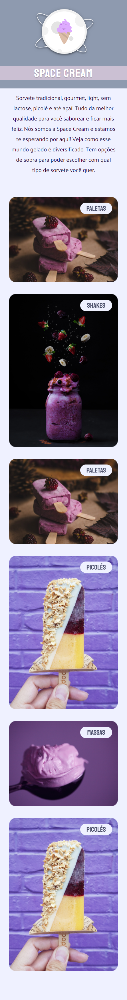

<h1 align="center">Explorer -  Stage03 - Space Cream</h1>

&nbsp;&nbsp;&nbsp;

 

---

## 💻 Projeto - Space Cream

Image Space cream Desktop

Image Space cream Mobile

## 🧪 Tecnologias | HTML e CSS
---
- Mobile First
- Unidade de medida flexível
- Variáveis
- Grid
- Animações e transições
- Media queries.

##  📕 Sobre  

Ema página da web responsiva para dispositivos Mobile first do zero usando o layout de protótipo disponível no figma. Fortalecer meus conhecimentos de HTML e CSS aplicando conceitos de GRID e o que foi visto nos projetos Fase 2 Fase 3 aplicam-se versões ao projeto, animações e transições em CSS.

Este é um projeto desenvolvido em treinamento, juntamente com a 
<a  href="https://www.rocketseat.com.br">Rocketseat</a> 🚀
no decorrer do programa <b>Explorer</b>.

### Informações  

📅 **02.09.2023**

🕛 **Status:** Concluído✔️

☑️ **Task:** Construir um site estático a partir do projeto feito no [Figma](https://www.figma.com).
- [Design Figma - Space Cream Mobile](https://www.figma.com/file/drBBktNRdtCIUiN4cZk4yo?node-id=0:1)
- [Design Figma - Space Cream Desktop](https://www.figma.com/file/pddZCuQIRLjk5dEHQ4L4YR?node-id=0:1)
- [EXPLORER - Rocketseat](https://www.rocketseat.com.br/explorer)

Developed by Jeferson 🚀

